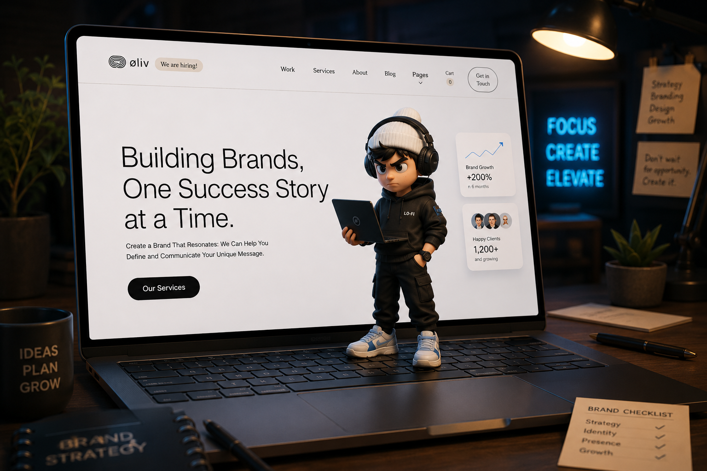

# Øliv — Building Brands, One Success Story at a Time.

> A modern branding & agency-style landing page — built with pure HTML & CSS, no JavaScript.  
> Created as part of **Sheryians Coding School, Cohort 3.0** — Assignment Project.

---

## 🌐 Live Demo

[View Live Project →](https://oliv-build-brands.vercel.app/) 

---

## 📸 Preview



---

## 📌 About the Assignment

Part of a structured frontend assignment from Sheryians Coding School. I picked the hardest task — replicating a modern branding/agency-style landing page using CSS Grid, layout architecture, and responsive design.

**Constraint: pure HTML & CSS only. No JavaScript.**

---

## ⚙️ Development Story

The reference layout wasn't rendering correctly on my screen due to responsive inconsistencies. To fix this, I installed a viewport simulator extension and configured it to match a **MacBook M1 viewport**, then built against that simulated view side-by-side with my own.

---

## ⚠️ Challenges & Solutions

| Challenge | Solution |
|-----------|----------|
| Broken reference layout | Simulated MacBook M1 viewport via browser extension |
| Viewport-dependent inconsistencies | Tested methodically in real environments, fixed breakpoint by breakpoint |
| CSS Grid complexity | Rebuilt grid sections multiple times from scratch |
| Responsive design (not in curriculum) | Self-directed research, media queries, iteration |
| Mobile hierarchy breakdown | Fixed typography scaling and grid reflow per breakpoint |

---

## ✨ Features

- Agency/branding-style layout with dominant hero section
- Bento-style CSS Grid with clear visual hierarchy
- Oversized hero typography for immediate visual impact
- Intentional CTA placement and hover micro-interactions
- Fully responsive — Desktop, Tablet, Mobile via two clean breakpoints
- Zero JavaScript — pure HTML & CSS
- Lightweight, no dependencies or build tools

---

## 🛠 Tech Stack

`HTML5` &nbsp; `CSS3` &nbsp; `CSS Grid` &nbsp; `Flexbox` &nbsp; `Responsive Design` &nbsp; `Hover Animations`

---

## 📐 Responsive Design

Two deliberate breakpoints:

```css
@media (max-width: 960px) { ... }
@media (max-width: 768px) { ... }
```

A 1024px breakpoint was tested but consistently disturbed the desktop grid. The 960/768 pair was the most stable and maintainable choice.

---

## 🎨 CSS Techniques

- **Grid** — `grid-template-areas`, `grid-column/row`, `grid-template-columns/rows` for bento-style layout
- **Flexbox** — internal card alignment, nav, and CTA positioning
- **Transitions** — `transform`, `opacity` for smooth hover feedback
- **Typography** — oversized hero heading, scaled hierarchy per section
- **Spacing** — consistent `padding` and `gap` for visual rhythm

---

## 📂 Folder Structure

```
Assignment_5/
├── index.html
├── style.css
├── .gitignore
└── assets/
    ├── favicon/
    ├── fonts/
    └── images/
```

---

## 🚀 How to Run Locally

```bash
git clone https://github.com/your-username/oliv-landing-page
cd oliv-landing-page
open index.html
```

Or: **Download ZIP → Extract → Open `index.html`.**

---

## 📚 What I Learned

- CSS Grid is a layout system — structural thinking comes before code
- Responsive design is a design problem, not just a code problem
- Constraints force better decisions — no JS meant CSS-native solutions only
- Visual hierarchy is functional, not decorative
- Debugging without tutorials builds real understanding

---

## 🔮 Future Improvements

- JavaScript for smooth scroll and mobile menu toggle
- CSS custom properties for cleaner theming
- Image optimization
- Third breakpoint for wider viewports
- Scroll-triggered animations via Intersection Observer API

---

## 🙏 Credits

- **Design Reference** — Sheryians Coding School, Cohort 3.0
- **Fonts** — Google Fonts

---

## 🌐 Connect

[GitHub](https://github.com/geetansh-sirohi) &nbsp;·&nbsp; [Instagram](https://www.instagram.com/code.with.geetansh/) &nbsp;·&nbsp; [LinkedIn](https://www.linkedin.com/in/geetansh-sirohi/)

---

*Built during Sheryians Coding School · Cohort 3.0 · Frontend Assignment*
